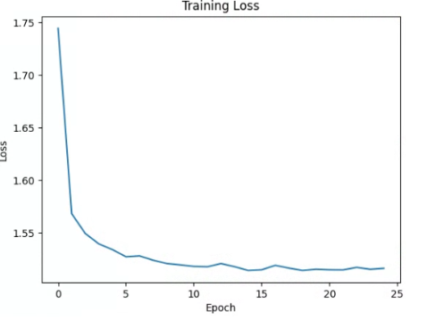
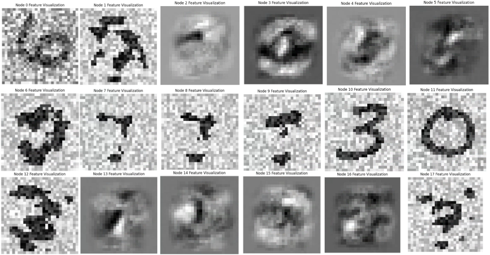
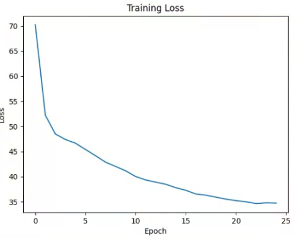
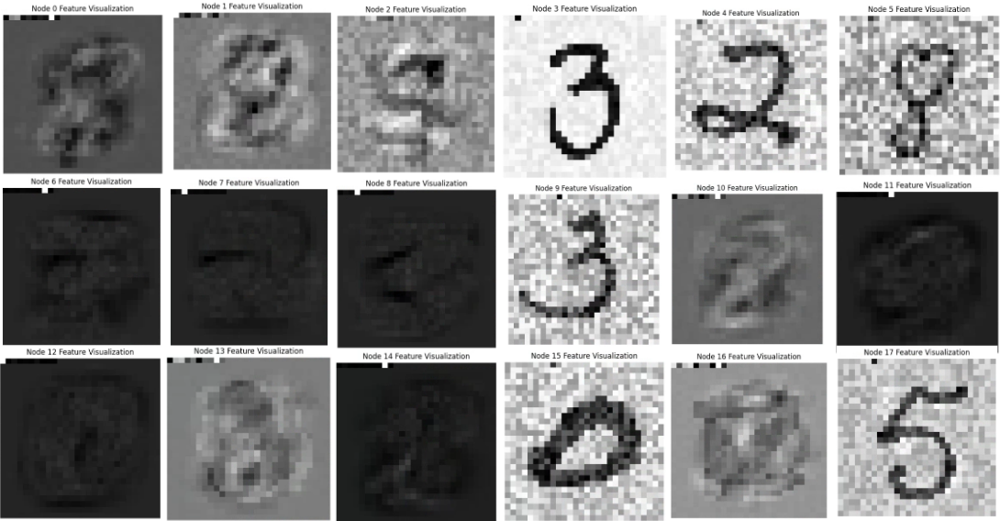
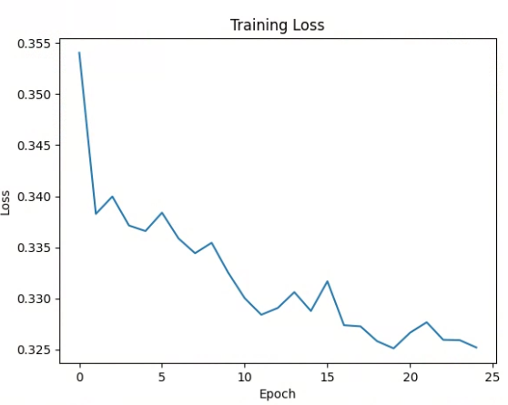
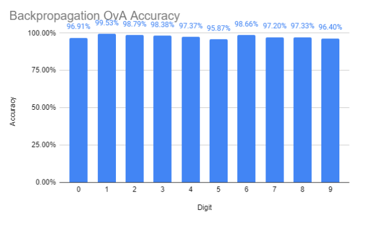
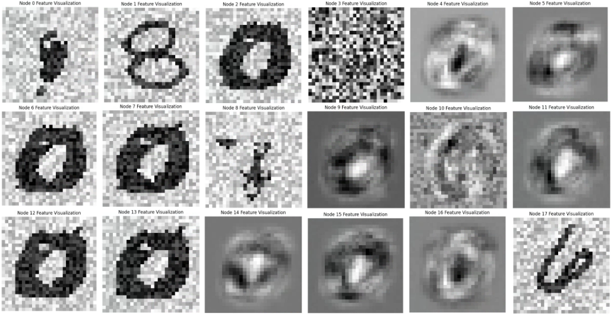
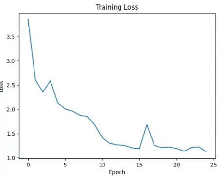
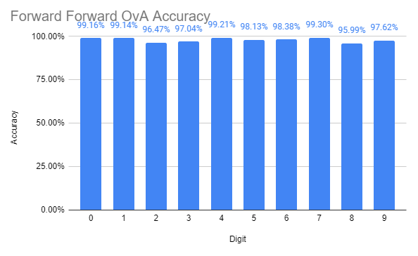
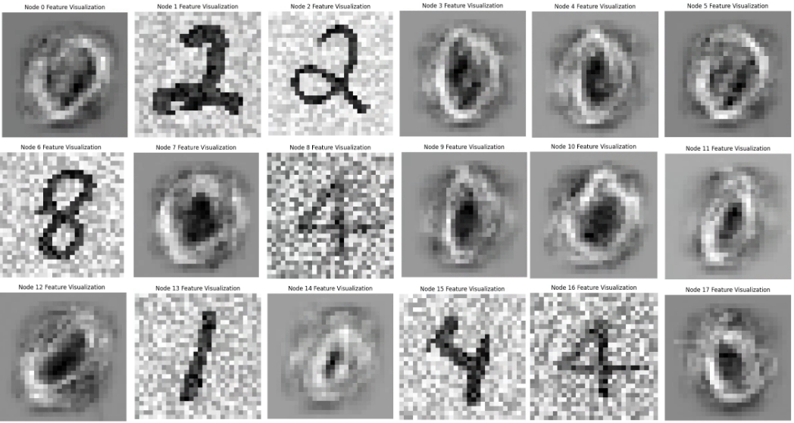

# EECS 690 Research
Research project comparing the Forward-Forward algorithm to conventional backpropagation, created with PyTorch

I study the features and accuracy of networks trained with either algorithm, both as a single model and using one vs all parallelism.
Only first-layer features were examined, since they would be the most intuitive for humans to look at.
Parts of the forward forward code are adapted from [Mohammad Pezeshki](https://github.com/mohammadpz/pytorch_forward_forward).

## Single Model

For the single models, I used a neural network of 3 fully connected layers (784 * 64, 64 * 64, 64 * 10).
All training was done using 25 epochs.

 

The backpropagation model trained normally, though the loss was higher than expected.

The single model for backpropagation achieved an accuracy of 94.86%.

The features of the backpropagation single model look ordinary.
Notice some of the features appear to be non-digit figures or fragmented digits.
This is because the backpropagation model assumes that all inputs are valid, since it is only trained on positive (real) data.
If we assume that the input is a digit, it is possible to see how these artifacts could provide insight into classifying the input.

 

The forward forward model had a high loss, but this may be partially attributed to the different loss function used.

The single model for forward forward achieved an accuracy of 91.73%, slightly worse than backpropagation.
Training was done by encoding the class into the first 10 pixels of the image.

These features seemed to be similar in quality compared to backpropagation.
There are no fragmented or non-digit features. Instead, there are "negative features", or features that represent negative (fake) inputs.

## One vs All Models

For the one vs all models, I used 10 neural networks of 3 fully connected layers (784 * 32, 32 * 32, 32 * 2).
All training was done using 25 epochs.

 

The backpropagation models seemed to have learned well, though training may have been stopped too early.

The models for backpropagation achieved a combined accuracy of 80.76%.

The model still has artifacts in its features.

 

A similar trend can be observed for the models that used forward forward.

The models for forward forward achieved a combined accuracy of 82.31%, slightly better than backpropagation.

These features seem similar in quality, though the edges of the zeros also more defined.

## Conclusion
Though the one vs all model for forward forward did not achieve a higher accuracy than the single model for backpropagation, the marginally better one vs all performance suggests the forward forward algorithm might be better at binary classification (or any other use cases where it would be beneficial to train on what is NOT real data).
Due to the nature of the algorithm incorporating negative data in training, I hypothesize that it can be more effective than backpropagation in these sort of binary classification problems.
