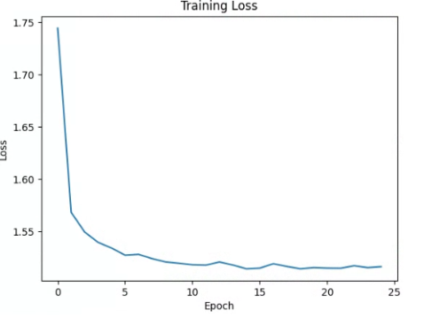
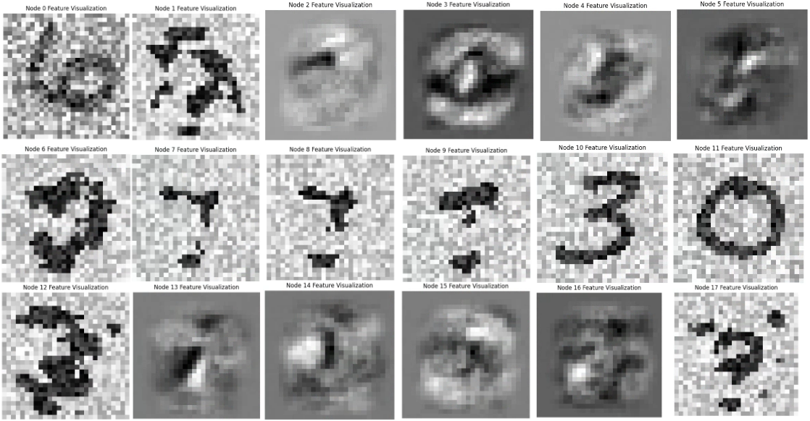
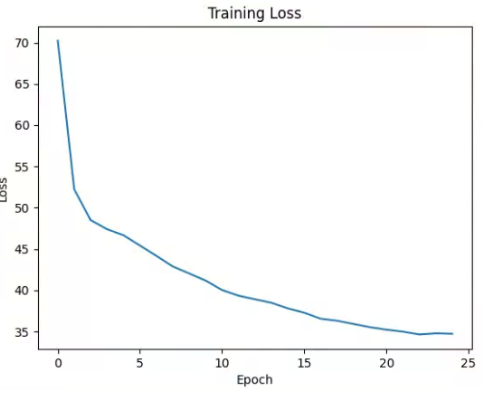
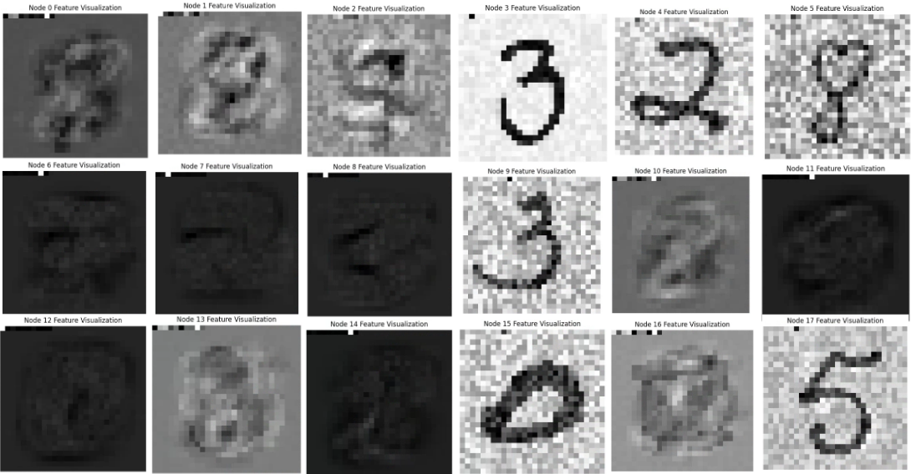
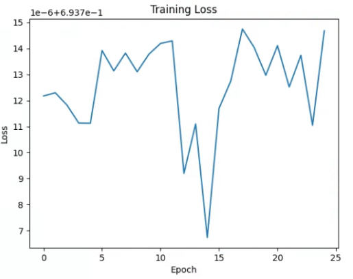
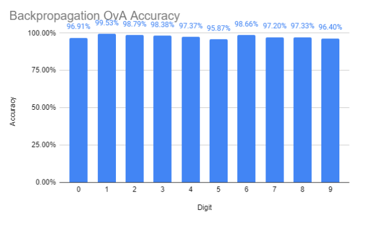
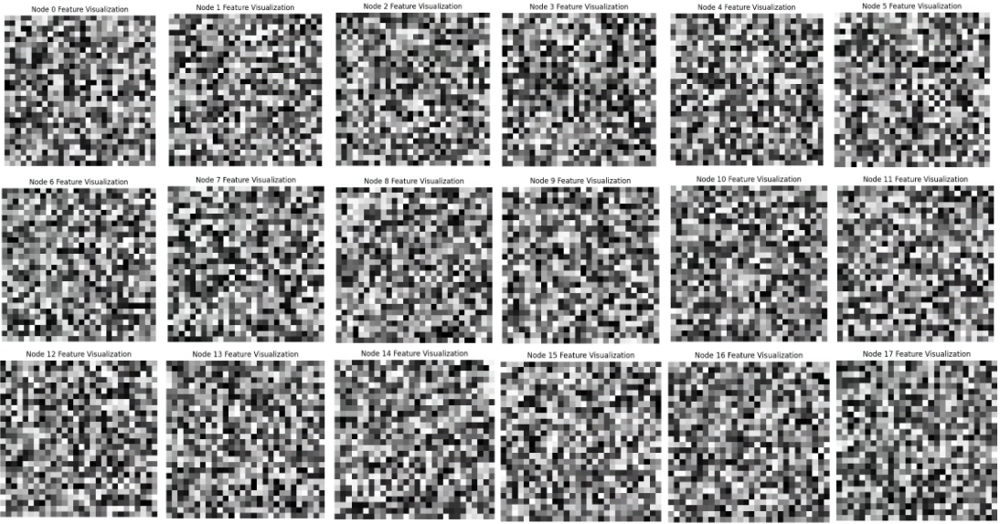
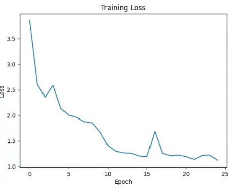
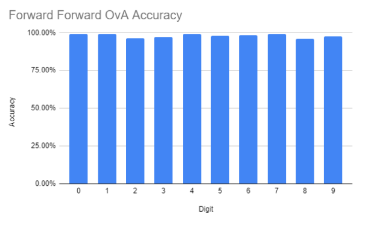
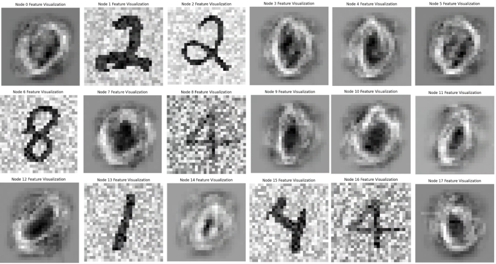

# EECS 690 Research
Research project comparing the Forward-Forward algorithm to conventional backpropagation, created with PyTorch

I study the features and accuracy of networks trained with either algorithm, both as a single model and using one vs all parallelism

Only first-layer features were examined, since they would be the most intuitive for humans to look at

Parts of the forward forward code are adapted from [Mohammad Pezeshki](https://github.com/mohammadpz/pytorch_forward_forward)

## Single Model

For the single models, I used a neural network of 3 fully connected layers (784 * 64, 64 * 64, 64 * 10)

All training was done using 25 epochs

 

The backpropagation model trained normally, though the loss was higher than expected

The single model for backpropagation achieved an accuracy of 94.86%

The single backpropagation features look ordinary

Notice some of the features with negative weights (light background) are non-digit figures

 

The forward forward model had a high loss, but this may be partially attributed to the different loss function used

The single model for forward forward achieved an accuracy of 91.73%, slightly worse than backpropagation

## One vs All Models

For the one vs all models, I used 10 neural networks of 3 fully connected layers (784 * 32, 32 * 32, 32 * 2)

All training was done using 25 epochs

 

The backpropagation models converged instantly, even after rewriting the code and using different loss functions

The models for backpropagation achieved an accuracy of 0.00%

This is because half of the models always predicted their target class while the other half always predicted the rest of the classes

As shown here, the model did not appear to learn much

 

The models for forward forward seemed to have learned well, though training may have been stopped too early

The models for forward forward achieved an accuracy of 82.31%
Each model had a very high accuracy, all above 95%

These features seem to represent the class very well, including features with negative weights

## Conclusion
Though the one vs all model for forward forward did not achieve a higher accuracy than the single mode for backpropagation, the algorithm may have practical use cases concerning binary classification

Due to the nature of the algorithm incorporating negative data in training, I hypothesize that it can be more effective than backpropagation
